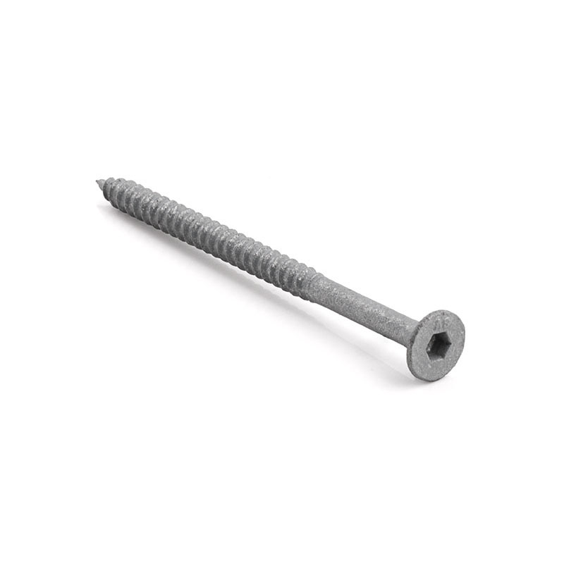

# Types of screws

## Bugle 

### Info
* Can be used for securing timber sleepers, decking frames, hard timber & even to masonry   
* Perfect for h3/h4 timber used in landscaping or gardens
* Self drilling + countersunk

## Detailed breakdown
Super helpful full guide covering:
* types of screws
* thread types
* Pre-drilling
* Screw heads
* Drive types
* Point types
* General tips
https://www.workshop.bunnings.com.au/t5/How-To/How-to-choose-the-right-screw-for-the-job/ba-p/105464
